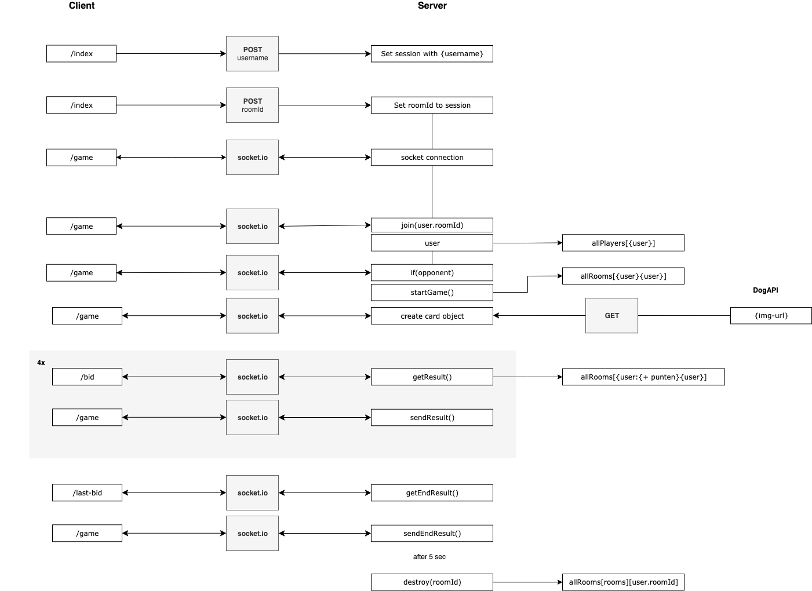

**🎓 Real-Time Web @cmda-minor-web · 2018-2019**

## NS Reismaatje

### Concept

Dit spel is geïnspireerd door Koehandel. Het doel van het spel is om zo veel mogelijk punten te scoren met verschillende honden. Diegene met het hoogste bod krijgt de hond. Dit wordt gespeeld tot het geld op is. Diegene die aan het einde van het spel de hoogste score heeft, wint!

### API

Voor deze app gebruik ik de [DOG API](https://dog.ceo/dog-api/). Deze API stuurt foto's terug van honden.

Voordat je gebruik kunt maken van de API, moet je een account aanmaken en krijg je een key die toegang geeft to de data. Er is een limiet aan het aantal calls dat uitgevoerd mag worden, hoeveel dit er zijn staat nergens gedocumenteerd 🤓.

Deze API is niet real-time, maar dit los ik op door andere real-time functies in de rest van de app.

### Data

##### Data life cycle

Dit is de data life cycle van de app:



Toelichting:

1. POST `username` naar server.
2. `username` wordt opgeslagen in een `session`.

```
    Session {
      cookie:
       { path: '/',
         _expires: null,
         originalMaxAge: null,
         httpOnly: true },
      user: { username: 'Kees' } }
```

3. Client genereed een uniek `roomId` of stuurt eigen gekozen `roomId` mee.

4. POST: `roomId` naar server.

5. `roomId` wordt opgeslagen in bijbehorende `session`.

```
    Session {
      cookie:
       { path: '/',
         _expires: null,
         originalMaxAge: null,
         httpOnly: true },
      user: { username: 'sterre', roomId: '2745' } }
```

6. Redirect naar `/game`

7. Connect client met `socket.io`

8. Sla `user` op in `[allPlayers]`

9. join de `user` in `roomId` met bhv. socket.io

10. Als er een tegenstander is, verstuur de tegenstander dan naar diegene met dezelfde `roomId`

11. Als er een tegenstander is, wordt het spel gestart.

12. Sla het huidige spel op in `[allRooms]`

```
    [ { '5396': [ { username: 'Jan',
        roomId: '3769',
        id: 'o6lFEXlLqOzBsgyVAAAA',
        bid: 0,
        game: 0 },
      { username: 'Kees',
        roomId: '3769',
        id: '_IzIL4i-oC1-0QtpAAAB',
        bid: 0,
        game: 0 } ]
     } ]
```

13. Creëer `card`, door een fetch met een honden API (haalt url van een foto op).

```
    { image: 'https://images.dog.ceo/breeds/stbernard/n02109525_5385.jpg',
      points: 85 // random getal tussen 1 en 100
    }
```

14. Verstuur `card` via sockets naar de clients.

15. Zodra allebei de gebruikers een antwoord verstuurd hebben via de socket, wordt de waarde op de server in `[allRooms]` opgeslagen.

```
     { username: 'Jan',
        roomId: '3769',
        id: 'o6lFEXlLqOzBsgyVAAAA',
        bid: 10, // + 10
        game: 0 }
```

16. Bekijk wie er meer geboden heeft en sla de punten van de `card` op.

```
     { username: 'Jan',
        roomId: '3769',
        id: 'o6lFEXlLqOzBsgyVAAAA',
        bid: 10, // + 10
        game: 43 }
```

17. Reset `bid`

```
    { username: 'Jan',
      roomId: '3769',
      id: 'o6lFEXlLqOzBsgyVAAAA',
      bid: 0, // reset
      game: 43
    }
```

18. Dit gaat 4x zo door. Dan wordt er bekeken welke `user` de hoogste waarde in `user.game` heeft.

19. De users krijgen de uitslag te zien via de socket.

20. Daarna wordt na 5sec de gehele `room` vanuit `allRooms` en de `session` gewist. Het spel kan opnieuw gespeeld worden.

### Wat ik graag nog had willen doen

-   [ ] data opslaan in database (bijv. Mongo) ipv lokaal

---

#### Week 1: Real Time Emoji Chat App 💬

<details>
<summary>Week 1 chatapp</summary>

With this application users chat. If a word in the messages suits a emoji, the emoji will replace the word.


## Install

```

git clone https://github.com/sterrevangeest/real-time-web-1819

cd project-2-1819

npm install

npm run server

```

## How it works

To create a real time web application I used the [socket.IO](https://socket.io/) library. Socket.IO enables realtime, bi-directional communication between the client-side and server-side.

To start my first real time web app, I follow this [tutorial](https://socket.io/get-started/chat/). Later I added extra features. Like replacing words with emoji's.

```js
// server-side: index.js
io.on("connection", socket => {
  socket.on("chat message", msg => {
    var msg = msg.split(" ").map(word => return emoji.get(word) || word);
    var msg = msg
      .toString()
      .replace(/,/g, " ")
      .replace(/:/g, "");
    io.emit("chat message", msg);
  });
});

```

</details>

<!-- Add a link to your live demo in Github Pages 🌐-->

<!-- ☝️ replace this description with a description of your own work -->

<!-- Add a nice image here at the end of the week, showing off your shiny frontend 📸 -->

<!-- Maybe a table of contents here? 📚 -->

<!-- How about a section that describes how to install this project? 🤓 -->

<!-- ...but how does one use this project? What are its features 🤔 -->

<!-- What external data source is featured in your project and what are its properties 🌠 -->

<!-- This would be a good place for your data life cycle ♻️-->

<!-- Maybe a checklist of done stuff and stuff still on your wishlist? ✅ -->

<!-- How about a license here? 📜 (or is it a licence?) 🤷 -->
