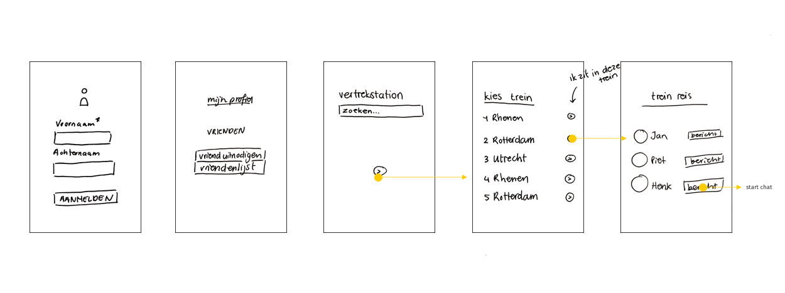
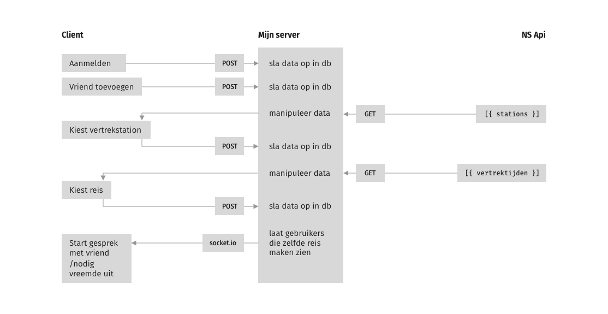
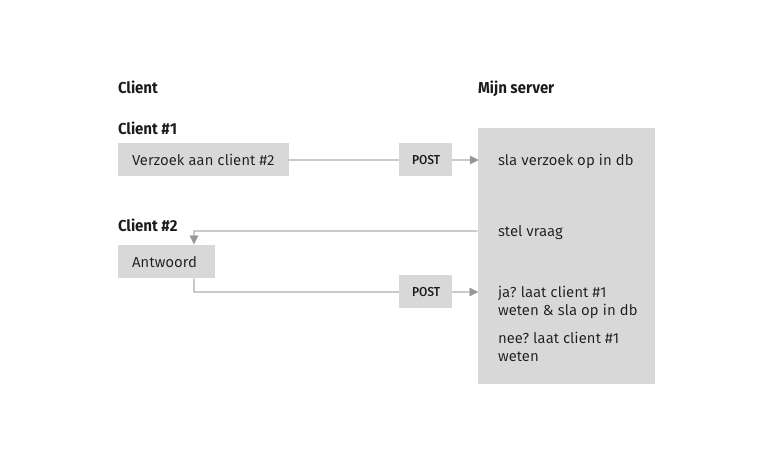
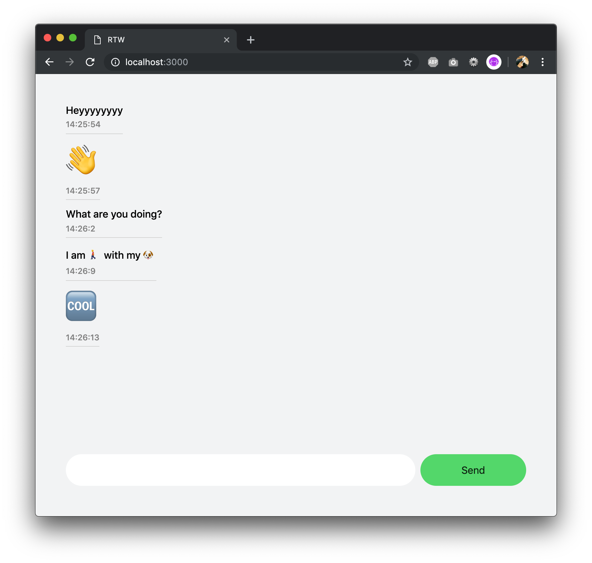

**🎓 Real-Time Web @cmda-minor-web · 2018-2019**

## NS Reismaatje

### Concept

Het gebeurt mij best vaak dat ik op mijn "eindstation" uitstap en een bekende tegenkom. Dan is het jammer dat je al die tijd in dezelfde trein hebt gezeten maar elkaar niet heb kunnen spreken. Met deze app wil ik de gebruiker laten zien welke bekende op dat moment in ook in de trein zit.

##### Schets

Dat wil ik er ongeveer zo uit laten zien:



### API

Voor deze app gebruik ik de [NS API](https://www.ns.nl/reisinformatie/ns-api). In deze API kan ik o.a. data vinden over:

- Actuele vertrektijden
- Storingen en werkzaamheden
- De stationslijst met alle stations in Nederland inclusief Geodata
- Reisadviezen van station naar station

Voordat je gebruik kunt maken van de API, moet je een account aanmaken en krijg je een key die toegang geeft to de data. Er is een limiet aan het aantal calls dat uitgevoerd mag worden, hoeveel dit er zijn staat nergens gedocumenteerd 🤓.

Deze API is niet real-time, maar dit los ik op door de gebruiker real-time aan te laten geven in welke trein ze zitten.

### Data

##### Data life cycle

Dit is de data life cycle van de app tot nu toe:



Toelichting:

1. De gebruiker geeft een aantal gegevens door om aan te kunnen melden. Dit wordt verstuurd naar de `server`.
2. Op de `server` wordt deze data opgeslagen.
   De gebruiker kan een vriend toevoegen aan zijn/haar profiel. Dat ziet er zo uit:
   
3. De `server` vraagt aan de `NS API` alle stations op.
4. Het antwoord wat de `NS API` naar de server stuurt:

   ```js
   {
     "links": {},
     "payload": [
       {
         "sporen": [Array],
         "synoniemen": [],
         "heeftFaciliteiten": true,
         "heeftVertrektijden": true,
         "heeftReisassistentie": false,
         "code": "AC",
         "namen": [Object],
         "stationType": "STOPTREIN_STATION",
         "land": "NL",
         "UICCode": "8400047",
         "lat": 52.2785,
         "lng": 4.977,
         "radius": 200,
         "naderenRadius": 1200,
         "EVACode": "8400047"
       }
       // more results...
     ]
   }
   ```

5. Op de `server` filter ik de data naar onderstaande en stuur dit naar de `client`.

   ```js
   [
     { stationName: "Abcoude", stationId: "8400047" }
     // more results...
   ];
   ```

6. De gebruiker stuurt kiest het vetrekpunt uit de lijst met stations, dit wordt opgeslagen op de `server`.
7. Voor het gekozen station haalt de `server` de vertrektijden bij dit station op uit de `NS API`.
8. Antwoord wat de `NS API` naar de `server` stuurt:

   ```js
   [
     {
       links: {},
       payload: {
         source: "PPV",
         departures: [
           {
             direction: "Rhenen",
             name: "NS  7439",
             plannedDateTime: "2019-04-18T11:33:00+0200",
             plannedTimeZoneOffset: 120,
             actualDateTime: "2019-04-18T11:33:00+0200",
             actualTimeZoneOffset: 120,
             plannedTrack: "3",
             product: {
               number: "7439",
               categoryCode: "SPR",
               shortCategoryName: "NS Sprinter",
               longCategoryName: "Sprinter",
               operatorCode: "NS",
               operatorName: "NS",
               type: "TRAIN"
             },
             trainCategory: "SPR",
             cancelled: false,
             routeStations: [
               {
                 uicCode: "8400133",
                 mediumName: "Breukelen"
               },
               {
                 uicCode: "8400621",
                 mediumName: "Utrecht C."
               },
               {
                 uicCode: "8400182",
                 mediumName: "Driebergen-Zeist"
               },
               {
                 uicCode: "8400417",
                 mediumName: "Maarn"
               }
             ],
             departureStatus: "INCOMING"
           } //more results
         ]
       }
     }
   ];
   ```

9. Op de `server` wordt de data gefilterd naar onderstaande en wordt gestuurd naar de `client`.

   ```js
   [
     {
       direction: "Rhenen",
       plannedDateTime: "2019-04-18T11:33:00+0200",
       trainType: "Sprinter",
       plannedTrack: "3",
       tripId: "NS7439"
     } // more results
   ];
   ```

10. De client kiest de treinreis die hij/zij gaat maken.
11. De `tripId` wordt opgeslagen bij de juiste gebruiker op de `server`.
12. Alle gebruikers die een overeenkomende `tripId` hebben zien welke reizigers ook in die specifieke trein zitten. Waneer er vrienden in dezelfde trein zitten kunnen zij direct chatten. Nog niet bevriende gebruikers kunnen elkaar uitnodigen en dan alsnog chatten.

De structuur in de database komt er zo uit te zien:

```js
[
  {
    voornaam: "string",
    achternaam: "string",
    gebruikersnaam: "string",
    wachtwoord: "hash",
    vrienden: [
      {
        gebruikersnaam: "string"
      }
    ],
    reis: [
      {
        direction: "string",
        plannedDateTime: "string",
        trainType: "string",
        plannedTrack: "string",
        tripId: "string"
      }
    ]
  }
];
```

---

#### Week 1: Real Time Emoji Chat App 💬

<details>
<summary>Week 1 chatapp</summary>

With this application users chat. If a word in the messages suits a emoji, the emoji will replace the word.


## Install

```

git clone https://github.com/sterrevangeest/real-time-web-1819

cd project-2-1819

npm install

npm run server

```

## How it works

To create a real time web application I used the [socket.IO](https://socket.io/) library. Socket.IO enables realtime, bi-directional communication between the client-side and server-side.

To start my first real time web app, I follow this [tutorial](https://socket.io/get-started/chat/). Later I added extra features. Like replacing words with emoji's.

```js
// server-side: index.js
io.on("connection", socket => {
  socket.on("chat message", msg => {
    var msg = msg.split(" ").map(word => return emoji.get(word) || word);
    var msg = msg
      .toString()
      .replace(/,/g, " ")
      .replace(/:/g, "");
    io.emit("chat message", msg);
  });
});

```

</details>

<!-- Add a link to your live demo in Github Pages 🌐-->

<!-- ☝️ replace this description with a description of your own work -->

<!-- Add a nice image here at the end of the week, showing off your shiny frontend 📸 -->

<!-- Maybe a table of contents here? 📚 -->

<!-- How about a section that describes how to install this project? 🤓 -->

<!-- ...but how does one use this project? What are its features 🤔 -->

<!-- What external data source is featured in your project and what are its properties 🌠 -->

<!-- This would be a good place for your data life cycle ♻️-->

<!-- Maybe a checklist of done stuff and stuff still on your wishlist? ✅ -->

<!-- How about a license here? 📜 (or is it a licence?) 🤷 -->
